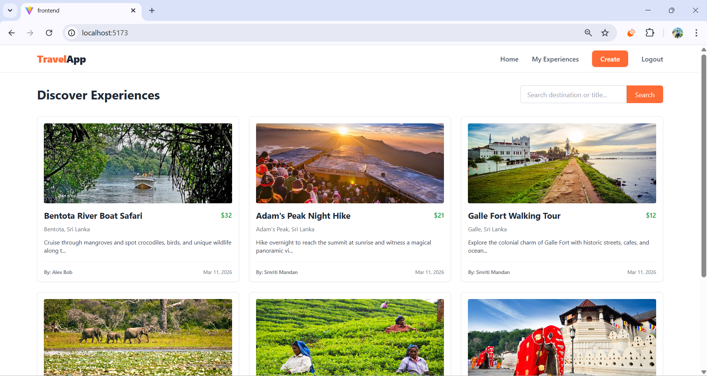
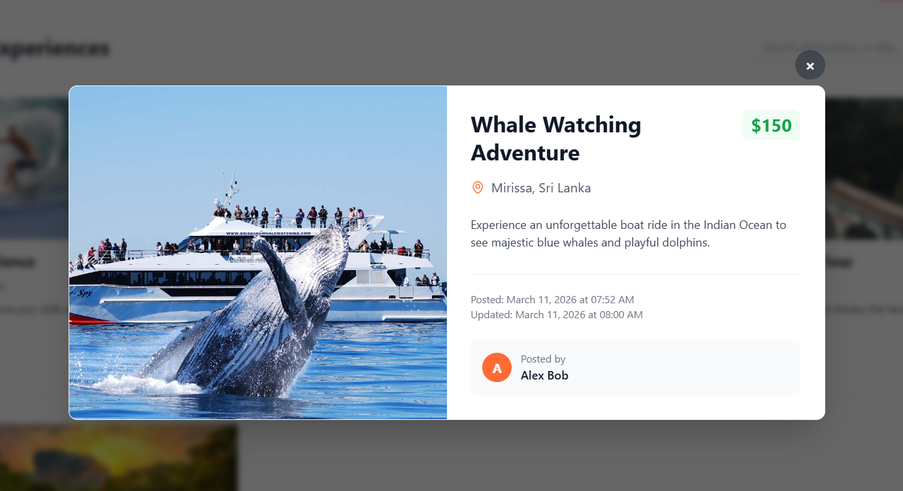
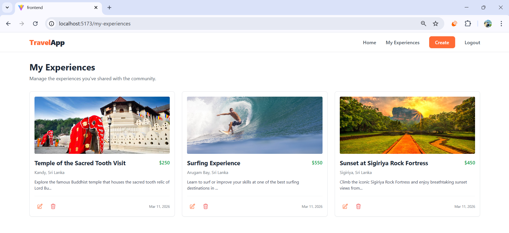

# Mini Travel Experience Listing Platform

A straightforward, modern full-stack MERN (MongoDB, Express, React, Node.js) application built for the Full-Stack Technical Challenge.

This project is a localized marketplace platform where users can create an account, browse travel experiences in a public feed, and publish their own unique travel experiences. 

## Overview

Many local tour guides, activity hosts, and operators do not have their own websites. Travelers also find it difficult to discover unique local activities seamlessly. 

This application bridges that gap by allowing users to explore travel experiences worldwide and enabling authenticated users to list their own sunset boat tours, yoga classes, or local experiences securely in one robust dashboard. Built rapidly with a focus on modern user experience and clean full-stack architectural practices.

## Project Structure

travel-app
│
├── backend
│   ├── controllers
│   ├── models
│   ├── routes
│   ├── middleware
│   └── server.js
│
├── frontend
│   ├── public
│   ├── src
│   │   ├── api
│   │   ├── components
│   │   ├── context
│   │   ├── pages
│   │   ├── App.jsx
│   │   └── main.jsx
│   └── tailwind.config.js
│
├── README.md
│
└── screenshots

## Features Implemented
- **JWT Authentication:** Secure user registration, login, and robust session persistence via tokens, protected routes, and interceptors.
- **Experience Posting:** Authenticated users can create listings that immediately populate into the global feed with title, location, image, short description, and price.
- **Global Public Feed:** A responsive feed displaying all travel listings (from newest to oldest). Clicking a listing opens a modal that pulls detailed information.
- **CRUD Operations:** Creators can safely manage (Update or Delete) their own listings. A dynamic state update ensures the UI reflects these changes without reloading the page.
- **Full-Text Search:** Users can filter listings by location or title directly from the frontend feed.
- **Tailwind CSS Styling:** A fully custom, clean, and beautifully colored UI with mobile-responsive flex layouts, active hover states, and fully customized components.
- **Pagination:** Built-in backend pagination with reusable frontend components to restrict payloads to 9 items per page.

## Tech Stack

**Frontend:**
- React (Vite)
- React Router DOM
- Tailwind CSS
- Axios

**Backend:**
- Node.js & Express
- MongoDB & Mongoose
- JSON Web Tokens (JWT) & bcryptjs
- Cors & dotenv

## API Endpoints

### Auth
- `POST /api/auth/register`
- `POST /api/auth/login`

### Experiences
- `POST /api/experiences` (Create a listing)
- `GET /api/experiences` (Get public feed)
- `GET /api/experiences/mine` (Get logged-in user's personalized listings)
- `GET /api/experiences/:id` (Get a single listing)
- `PUT /api/experiences/:id` (Update a listing)
- `DELETE /api/experiences/:id` (Delete a listing)

## Setup Instructions

### 1. Clone the repository
```bash
git clone https://github.com/sheda3838/travel-app.git
cd travel-app
```

### 2. Environment Variables
You will need to set up `.env` files in both the `backend` and `frontend` directories. 

**Backend (`backend/.env`):**
Create the file:
```env
PORT=5000
MONGO_URI=your_mongodb_connection_string
JWT_SECRET=your_jwt_secret
```

**Frontend (`frontend/.env`):**
Create the file:
```env
VITE_API_URL=http://localhost:5000/api
```

### 3. Install Dependencies & Run

**Start the Backend:**
```bash
cd backend
npm install
npm run dev
```

**Start the Frontend:**
Open a new terminal window:
```bash
cd frontend
npm install
npm run dev
```

The application will now be running on `http://localhost:5173`.

## Architecture & Key Decisions

- **Why the MERN Stack?**: I chose MongoDB, Express, React, and Node.js for their seamless integration and agility. Node/Express securely handles robust API calls while naturally mapping to MongoDB’s JSON documentation architecture. React, coupled with Tailwind CSS, provided the fastest way to deploy reusable, responsive, and robust front-end components.
- **Authentication**: Authentication operates statelessly via JSON Web Tokens (JWT). A `bcryptjs` hash protects user passwords. When a user authenticates, the client stores the JWT in `localStorage` and embeds it as a `Bearer` token on subsequent API requests through a global Axios interceptor. A global React `AuthContext` syncs session state.
- **Database Structure**: Travel listings are stored in a MongoDB `Experience` collection. Crucially, I used MongoDB's `ObjectId` relations to map an experience's `creator` field directly to a `User` document. Utilizing `Mongoose.populate()`, the API efficiently retrieves creator display names without executing messy secondary queries on the frontend.
- **One Improvement**: If I had additional time, I would implement **Image Uploading to Cloud Storage (AWS S3 or Cloudinary)** using Multer. Currently, relying purely on direct Image URLs can lead to broken images if external servers go down. Hosting our own compressed images ensures long-term robustness and performance.

## Reasonable Assumptions Made

1. **Email Verification:** Email verification is simulated. Upon completing the registration form, users are immediately active and redirected seamlessly to the login sequence.
2. **Post-Creation Redirection:** After users log in or create a listing, they are redirected to the homepage public feed so they can immediately see their live data.
3. **Filtering Rules:** While searching queries across `location` and `title`, I added a rule limiting the feed size per page (6 elements) to strictly manage JSON payload sizes on the network, guaranteeing standard speeds.
4. **Theme Tracking:** While standard styles exist, I added a cohesive custom primary brand color (#FF6B35) for buttons and inputs that spans globally across both login portals and feed applications for superior aesthetic cohesion.

## Future Improvements

- AWS S3 or Cloudinary automated image bucket storing instead of URLs.
- Built-in map integration (Google Maps / Mapbox) corresponding to "location" strings.
- Interactive user reviews and star rating schemas for the experiences.
- Adding a "Favorites" bookmark section restricted explicitly to logged-in users.

## Product Thinking Question
**If this platform had 10,000 travel listings, what changes would you make to improve performance and user experience?**

If the platform had 10,000 travel listings:
- Implement server-side pagination or infinite scroll to reduce initial load.
- Use database indexing on commonly searched fields (title, location) to speed up queries.
- Implement caching strategies (e.g., Redis) for frequently accessed public feed data.
- Optimize API responses, returning only necessary fields for listing previews.
- Consider load balancing if user traffic spikes.
- Add frontend filtering to reduce the number of API calls.

## Screenshots

### Main Feed


### Experience Details Modal


### My Experiences

